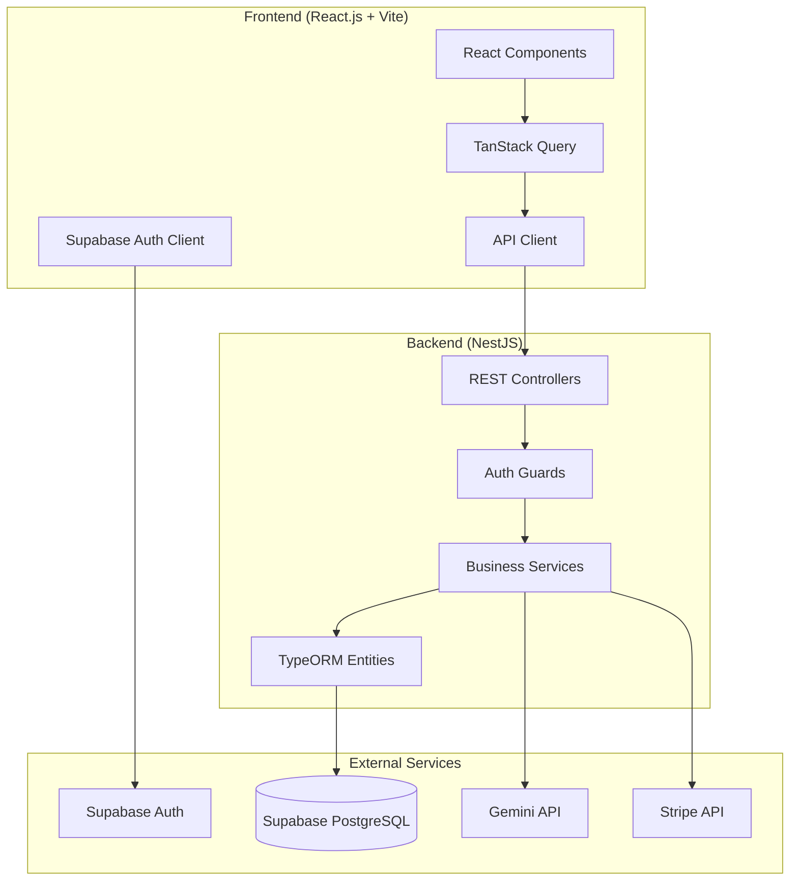
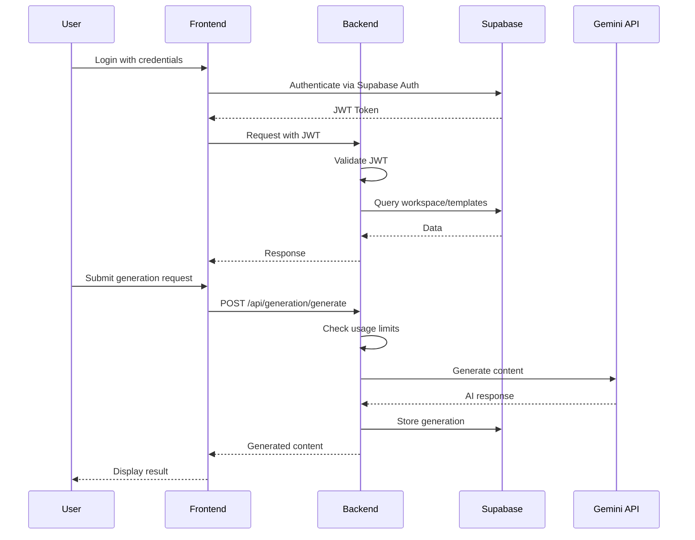

# Design Document: ProWrite AI

## Overview

ProWrite AI is a specialized AI content generation platform built with a modern tech stack: React.js frontend, NestJS backend, and Supabase for database and authentication. The platform provides industry-specific templates for software documentation and professional email writing, differentiating itself from generic AI assistants through pre-built workflows, brand voice training, and batch generation capabilities.

The architecture follows a clean separation of concerns with a RESTful API backend, JWT-based authentication, and a responsive single-page application frontend.

## Architecture



### System Flow



## Components and Interfaces

### Backend Components

#### 1. Auth Module
```typescript
// auth.controller.ts
interface AuthController {
  login(body: { access_token: string }): Promise<AuthResponse>;
  getCurrentUser(req: AuthenticatedRequest): UserInfo;
}

// auth.service.ts
interface AuthService {
  handleSupabaseUser(supabaseUser: SupabaseUser): Promise<AuthResponse>;
  validateToken(token: string): TokenPayload;
}

interface AuthResponse {
  access_token: string;
  workspace_id: string;
  email: string;
}
```

#### 2. Generation Module
```typescript
// generation.controller.ts
interface GenerationController {
  generateContent(body: GenerateRequest, req: AuthenticatedRequest): Promise<GenerationResult>;
  listGenerations(req: AuthenticatedRequest): Promise<Generation[]>;
  getGeneration(id: string, req: AuthenticatedRequest): Promise<Generation>;
  deleteGeneration(id: string, req: AuthenticatedRequest): Promise<void>;
}

// generation.service.ts
interface GenerationService {
  generateContent(workspaceId: string, templateId: string, inputData: Record<string, any>): Promise<GenerationResult>;
  listGenerations(workspaceId: string): Promise<Generation[]>;
  getGeneration(id: string, workspaceId: string): Promise<Generation>;
}

// gemini.service.ts
interface GeminiService {
  generateContent(prompt: string, systemInstruction: string): Promise<{ content: string; tokens: number }>;
  generateVariations(prompt: string, systemInstruction: string, count: number): Promise<string[]>;
}
```

#### 3. Templates Module
```typescript
// templates.controller.ts
interface TemplatesController {
  getTemplates(moduleType?: string): Promise<Template[]>;
  getTemplate(id: string): Promise<Template>;
  createTemplate(body: CreateTemplateDto, req: AuthenticatedRequest): Promise<Template>;
}

// templates.service.ts
interface TemplatesService {
  getTemplatesByModule(moduleType: string): Promise<Template[]>;
  getTemplate(id: string): Promise<Template>;
  createDefaultTemplates(): Promise<void>;
}
```

#### 4. Workspace Module
```typescript
// workspace.controller.ts
interface WorkspaceController {
  getWorkspace(req: AuthenticatedRequest): Promise<Workspace>;
  updateWorkspace(body: UpdateWorkspaceDto, req: AuthenticatedRequest): Promise<Workspace>;
  getUsage(req: AuthenticatedRequest): Promise<UsageStats>;
}

// workspace.service.ts
interface WorkspaceService {
  getWorkspace(workspaceId: string): Promise<Workspace>;
  updateWorkspace(workspaceId: string, data: Partial<Workspace>): Promise<Workspace>;
  incrementUsage(workspaceId: string): Promise<void>;
  checkUsageLimit(workspaceId: string): Promise<boolean>;
}
```

### Frontend Components

#### 1. Authentication
```typescript
// hooks/useAuth.ts
interface UseAuth {
  user: User | null;
  loading: boolean;
  error: string | null;
  signUp(email: string, password: string): Promise<AuthData>;
  login(email: string, password: string): Promise<AuthData>;
  logout(): Promise<void>;
  isAuthenticated: boolean;
}
```

#### 2. API Client
```typescript
// lib/api.ts
interface ApiClient {
  generateContent(templateId: string, inputData: Record<string, any>): Promise<GenerationResult>;
  listGenerations(): Promise<Generation[]>;
  getGeneration(id: string): Promise<Generation>;
  getTemplates(moduleType: string): Promise<Template[]>;
  getTemplate(id: string): Promise<Template>;
  getWorkspace(): Promise<Workspace>;
  updateWorkspace(data: Partial<Workspace>): Promise<Workspace>;
}
```

#### 3. Page Components
```typescript
// Dashboard Layout
interface DashboardLayoutProps {
  children: React.ReactNode;
}

// Module Page (Cold Email, Website Copy, etc.)
interface ModulePageProps {
  moduleType: 'cold_email' | 'website_copy' | 'youtube_scripts' | 'hr_docs';
}

// Generation Form
interface GenerationFormProps {
  template: Template;
  onSubmit: (data: Record<string, any>) => void;
  isLoading: boolean;
}

// Generation Result
interface GenerationResultProps {
  content: string;
  tokens: number;
  onCopy: () => void;
  onRegenerate: () => void;
}
```

## Data Models

### Database Entities

```typescript
// Workspace Entity
interface Workspace {
  id: string;                          // UUID primary key
  user_id: string;                     // Supabase user ID
  name: string;                        // Workspace name
  description: string | null;          // Optional description
  brand_voice_guide: BrandVoiceGuide | null;  // JSON tone/style settings
  usage_limit: number;                 // Monthly generation limit
  usage_count: number;                 // Current month usage
  created_at: Date;
  updated_at: Date;
}

interface BrandVoiceGuide {
  tone: string;                        // e.g., "professional", "casual"
  style: string;                       // e.g., "concise", "detailed"
  terminology: string[];               // Industry-specific terms
  avoid: string[];                     // Words/phrases to avoid
}

// Template Entity
interface Template {
  id: string;                          // UUID primary key
  workspace_id: string | null;         // Null for system templates
  module_type: ModuleType;             // Enum: cold_email, website_copy, etc.
  name: string;                        // Template name
  description: string | null;          // Template description
  system_prompt: string;               // AI instruction prompt
  input_schema: InputSchema;           // JSON form field definitions
  output_format: string;               // Expected output structure
  tags: string[];                      // Searchable tags
  is_custom: boolean;                  // User-created vs system template
  created_at: Date;
  updated_at: Date;
}

interface InputSchema {
  fields: InputField[];
}

interface InputField {
  name: string;                        // Field identifier
  label: string;                       // Display label
  type: 'text' | 'textarea' | 'select' | 'number';
  required: boolean;
  placeholder?: string;
  options?: string[];                  // For select type
  validation?: {
    minLength?: number;
    maxLength?: number;
    pattern?: string;
  };
}

// Generation Entity
interface Generation {
  id: string;                          // UUID primary key
  workspace_id: string;                // Foreign key to workspace
  template_id: string;                 // Foreign key to template
  input_data: Record<string, any>;     // User inputs as JSON
  generated_content: string;           // AI output
  tokens_used: number;                 // Token count for billing
  status: GenerationStatus;            // Enum: pending, completed, failed
  error_message: string | null;        // Error details if failed
  created_at: Date;
  updated_at: Date;
}

type GenerationStatus = 'pending' | 'completed' | 'failed';

// Subscription Entity
interface Subscription {
  id: string;                          // UUID primary key
  workspace_id: string;                // Foreign key to workspace
  stripe_subscription_id: string | null;
  plan_type: PlanType;                 // Enum: free, starter, pro, enterprise
  status: SubscriptionStatus;          // Enum: active, canceled, past_due
  current_period_start: Date | null;
  current_period_end: Date | null;
  created_at: Date;
  updated_at: Date;
}

type PlanType = 'free' | 'starter' | 'pro' | 'enterprise';
type SubscriptionStatus = 'active' | 'canceled' | 'past_due';
type ModuleType = 'cold_email' | 'website_copy' | 'youtube_scripts' | 'hr_docs';
```

### DTOs (Data Transfer Objects)

```typescript
// Generation DTOs
interface GenerateRequestDto {
  template_id: string;
  input_data: Record<string, any>;
}

interface GenerationResultDto {
  id: string;
  content: string;
  tokens: number;
}

// Template DTOs
interface CreateTemplateDto {
  module_type: ModuleType;
  name: string;
  description?: string;
  system_prompt: string;
  input_schema: InputSchema;
  output_format: string;
  tags?: string[];
}

// Workspace DTOs
interface UpdateWorkspaceDto {
  name?: string;
  description?: string;
  brand_voice_guide?: BrandVoiceGuide;
}

// Auth DTOs
interface LoginDto {
  access_token: string;
}

interface AuthResponseDto {
  access_token: string;
  workspace_id: string;
  email: string;
}
```


## Correctness Properties

*A property is a characteristic or behavior that should hold true across all valid executions of a system-essentially, a formal statement about what the system should do. Properties serve as the bridge between human-readable specifications and machine-verifiable correctness guarantees.*

### Property 1: New User Workspace Creation
*For any* newly created user account, the system SHALL create exactly one workspace with default settings and one free subscription associated with that workspace.
**Validates: Requirements 1.4**

### Property 2: Invalid Credentials Error Safety
*For any* invalid credential submission (wrong email, wrong password, or both), the error message returned SHALL NOT reveal which specific field was incorrect.
**Validates: Requirements 1.5**

### Property 3: Workspace Update Round-Trip
*For any* workspace update operation, reading the workspace immediately after update SHALL return values equivalent to those that were set.
**Validates: Requirements 2.2**

### Property 4: Brand Voice Guide Serialization Round-Trip
*For any* valid brand voice guide object, serializing to JSON and deserializing back SHALL produce an equivalent object with identical tone, style, terminology, and avoid fields.
**Validates: Requirements 2.3**

### Property 5: Brand Voice Incorporation in Prompts
*For any* workspace with a configured brand voice guide, all generation requests from that workspace SHALL include brand voice elements in the system prompt sent to the AI.
**Validates: Requirements 2.4**

### Property 6: Template Module Filtering
*For any* module type query, all returned templates SHALL have a module_type field matching the requested module type.
**Validates: Requirements 3.1**

### Property 7: Template Display Completeness
*For any* template, the display representation SHALL contain the template name, description (if present), and all input fields defined in the input schema.
**Validates: Requirements 3.3**

### Property 8: Required Field Validation
*For any* template with required input fields, submitting a generation request missing any required field SHALL result in a validation error.
**Validates: Requirements 3.4**

### Property 9: Template Serialization Round-Trip
*For any* valid template object, serializing to JSON storage format and deserializing back SHALL produce an equivalent template with identical structure and values.
**Validates: Requirements 3.5, 3.6**

### Property 10: Generation Record Storage
*For any* successful AI generation, the stored generation record SHALL contain the generated content and a non-negative token count.
**Validates: Requirements 4.2**

### Property 11: Usage Count Increment
*For any* successful generation, the workspace usage_count SHALL increase by exactly 1.
**Validates: Requirements 4.3**

### Property 12: Failed Generation Status
*For any* generation where the AI API returns an error, the generation record status SHALL be 'failed' and error_message SHALL be non-empty.
**Validates: Requirements 4.4**

### Property 13: Usage Limit Enforcement
*For any* workspace where usage_count equals or exceeds usage_limit, generation requests SHALL be rejected with an appropriate error.
**Validates: Requirements 4.5**

### Property 14: Regeneration Creates New Record
*For any* regeneration request, a new generation record SHALL be created with the same input_data as the original generation.
**Validates: Requirements 4.6**

### Property 15: Cold Email Input Schema
*For any* cold email template, the input schema SHALL include fields for recipient_name, recipient_company, recipient_title, value_proposition, and tone.
**Validates: Requirements 5.2**

### Property 16: Cold Email Output Structure
*For any* generated cold email, the output SHALL contain both a subject line section and a body text section.
**Validates: Requirements 5.3**

### Property 17: A/B Variation Distinctness
*For any* A/B variation request generating N versions, all N generated versions SHALL be distinct from each other (no two versions are identical).
**Validates: Requirements 5.4**

### Property 18: Personalization Token Preservation
*For any* input containing personalization tokens in {{token_name}} format, the generated output SHALL preserve these tokens in the same format.
**Validates: Requirements 5.5**

### Property 19: Website Copy Input Schema
*For any* website copy template, the input schema SHALL include fields for product/service details, target audience, and key benefits.
**Validates: Requirements 6.2**

### Property 20: Landing Page Output Structure
*For any* generated landing page copy, the output SHALL contain headline, subheadline, benefits section, and CTA text sections.
**Validates: Requirements 6.3**

### Property 21: Bulk CSV Generation Count
*For any* bulk CSV generation request with N valid rows, exactly N product descriptions SHALL be generated.
**Validates: Requirements 6.4**

### Property 22: HR Template Input Schema
*For any* job description template, the input schema SHALL include fields for role_title, responsibilities, requirements, and company_culture.
**Validates: Requirements 7.2**

### Property 23: Generation History Sorting
*For any* generation history list, entries SHALL be sorted by created_at in descending order (most recent first).
**Validates: Requirements 8.1**

### Property 24: Generation View Completeness
*For any* generation record view, the response SHALL include input_data, generated_content, tokens_used, and status fields.
**Validates: Requirements 8.2**

### Property 25: Generation Deletion
*For any* deleted generation, subsequent retrieval attempts for that generation id SHALL return a not found error.
**Validates: Requirements 8.4**

### Property 26: Generation List Limit
*For any* generation list request, the result count SHALL NOT exceed 50 entries.
**Validates: Requirements 8.5**

### Property 27: Subscription Update on Confirmation
*For any* Stripe subscription confirmation, the workspace subscription record SHALL be updated with the new plan_type and corresponding usage_limit.
**Validates: Requirements 9.3**

### Property 28: Canceled Subscription Access
*For any* canceled subscription, the subscription status SHALL remain 'active' until current_period_end date is reached.
**Validates: Requirements 9.4**

### Property 29: Missing Token Authentication
*For any* API request without a valid JWT token in the Authorization header, the response SHALL be 401 Unauthorized.
**Validates: Requirements 10.1**

### Property 30: Cross-Workspace Authorization
*For any* API request attempting to access a workspace_id different from the authenticated user's workspace, the response SHALL be 403 Forbidden.
**Validates: Requirements 10.2**

### Property 31: Database Error Response
*For any* database operation failure, the API response SHALL be 500 with a generic error message that does not expose internal details.
**Validates: Requirements 10.4**

### Property 32: Input Validation Response
*For any* request with malformed or invalid input data, the API response SHALL be 400 Bad Request with a descriptive validation error message.
**Validates: Requirements 10.5**

## Error Handling

### Backend Error Handling Strategy

```typescript
// Global Exception Filter
@Catch()
export class GlobalExceptionFilter implements ExceptionFilter {
  catch(exception: unknown, host: ArgumentsHost) {
    const ctx = host.switchToHttp();
    const response = ctx.getResponse();
    
    if (exception instanceof HttpException) {
      const status = exception.getStatus();
      const message = exception.message;
      response.status(status).json({
        statusCode: status,
        message: message,
        timestamp: new Date().toISOString(),
      });
    } else {
      // Log internal error details
      console.error('Internal error:', exception);
      // Return generic message
      response.status(500).json({
        statusCode: 500,
        message: 'Internal server error',
        timestamp: new Date().toISOString(),
      });
    }
  }
}
```

### Error Categories

| Error Type | HTTP Status | User Message | Logging |
|------------|-------------|--------------|---------|
| Validation Error | 400 | Descriptive field errors | Debug |
| Authentication Failed | 401 | "Invalid credentials" | Info |
| Authorization Failed | 403 | "Access denied" | Warning |
| Resource Not Found | 404 | "Resource not found" | Debug |
| Usage Limit Exceeded | 402 | "Usage limit reached" | Info |
| Gemini API Error | 503 | "AI service unavailable" | Error |
| Database Error | 500 | "Internal server error" | Error |
| Rate Limit | 429 | "Too many requests" | Warning |

### Frontend Error Handling

```typescript
// API Error Handler
const handleApiError = (error: AxiosError) => {
  const status = error.response?.status;
  const message = error.response?.data?.message;
  
  switch (status) {
    case 401:
      // Redirect to login
      window.location.href = '/login';
      break;
    case 402:
      // Show upgrade modal
      showUpgradeModal();
      break;
    case 403:
      toast.error('You do not have access to this resource');
      break;
    case 429:
      toast.error('Please wait before making another request');
      break;
    default:
      toast.error(message || 'An error occurred');
  }
};
```

## Testing Strategy

### Dual Testing Approach

This project employs both unit testing and property-based testing to ensure comprehensive coverage:

1. **Unit Tests**: Verify specific examples, edge cases, and integration points
2. **Property-Based Tests**: Verify universal properties that should hold across all valid inputs

### Testing Framework

- **Backend**: Jest with `fast-check` for property-based testing
- **Frontend**: Vitest with React Testing Library and `fast-check`

### Property-Based Testing Configuration

```typescript
// jest.config.js (Backend)
module.exports = {
  // ... other config
  testTimeout: 30000, // Allow time for 100+ iterations
};

// Property test example structure
import * as fc from 'fast-check';

describe('Template Serialization', () => {
  it('should round-trip serialize/deserialize templates', () => {
    // **Feature: prowrite-ai, Property 9: Template Serialization Round-Trip**
    fc.assert(
      fc.property(
        templateArbitrary, // Custom arbitrary for Template
        (template) => {
          const serialized = JSON.stringify(template);
          const deserialized = JSON.parse(serialized);
          return deepEqual(template, deserialized);
        }
      ),
      { numRuns: 100 }
    );
  });
});
```

### Test Categories

#### Unit Tests
- Controller endpoint tests with mocked services
- Service method tests with mocked repositories
- Guard and interceptor tests
- DTO validation tests
- React component rendering tests
- Hook behavior tests

#### Property-Based Tests
- Data serialization round-trips (Properties 4, 9)
- Input validation (Properties 2, 8, 32)
- Business rule enforcement (Properties 11, 13, 26)
- Authorization checks (Properties 29, 30)
- Output structure validation (Properties 16, 20)

#### Integration Tests
- Full API endpoint tests with test database
- Authentication flow tests
- Generation workflow tests

### Test File Organization

```
backend/
├── src/
│   ├── modules/
│   │   ├── auth/
│   │   │   ├── auth.service.spec.ts      # Unit tests
│   │   │   └── auth.property.spec.ts     # Property tests
│   │   ├── generation/
│   │   │   ├── generation.service.spec.ts
│   │   │   └── generation.property.spec.ts
│   │   └── templates/
│   │       ├── templates.service.spec.ts
│   │       └── templates.property.spec.ts
│   └── common/
│       └── guards/
│           └── auth.guard.spec.ts

frontend/
├── src/
│   ├── components/
│   │   └── __tests__/
│   ├── hooks/
│   │   └── __tests__/
│   └── lib/
│       └── __tests__/
│           └── api.property.spec.ts
```

### Property Test Annotations

All property-based tests MUST include a comment referencing the correctness property:

```typescript
// **Feature: prowrite-ai, Property {number}: {property_text}**
```

This ensures traceability between tests and requirements.
